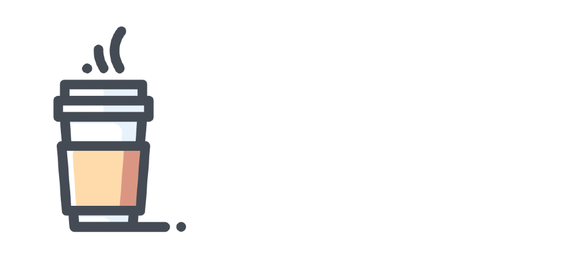

# ☕ My Coffee | Coffe Shop

<br />
<p align="center">
  <a href="https://github.com/eduardosouzv/my-coffee">
    
  </a>

  <h3 align="center">Buy a coffee just for fun !</h3>

  <p align="center">
    <a href="#">View Demo</a>
    ·
    <a href="https://github.com/eduardosouzv/my-coffee/issues">Report Bug</a>
    ·
    <a href="https://github.com/eduardosouzv/my-coffee/issues">Request Feature</a>
  </p>
</p>

<details open="open">
  <summary>Summary</summary>
  <ol>
    <li><a href="#about-the-project">About The Project</a></li>
    <li><a href="#getting-started">Getting Started</a></li>
  </ol>
</details>

## 🥤 About The Project

That is an side-project made to just practice and learn more about technologies that i've studying on my free time. So, feel free to test and buy a coffee !

### Built With

- [ReactJS](https://reactjs.org)
- [Typescript](https://www.typescriptlang.org)
- [NodeJS](https://nodejs.org)

## 🌳 Getting Started

### Installation

1. Clone the repo
   ```sh
   git clone https://github.com/eduardosouzv/my-coffee.git
   ```
   <!-- complete it here -->
